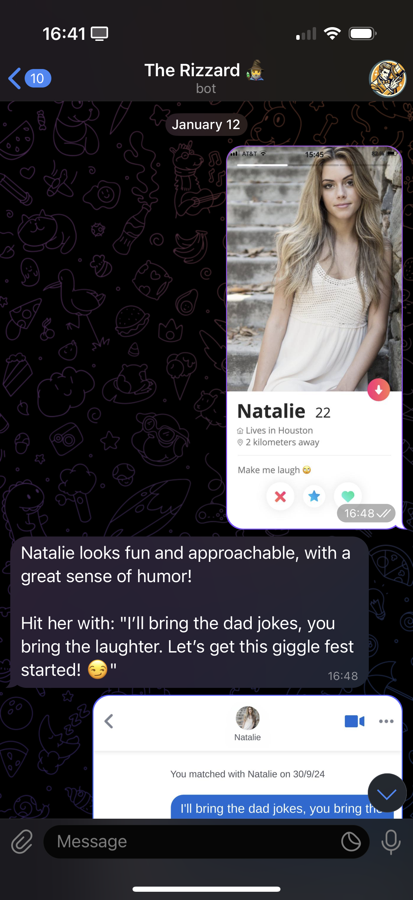

## Rizzard Bot

An AI-powered Telegram bot that acts like a casual dating coach. It gives short, actionable openers and next-message ideas, analyzes screenshots of profiles/conversations, and remembers user settings to tailor advice.

<div align="center">
  
  
  
</div>

### Features

- **Telegram bot** using `telegraf`
- **AI brain** with `langchain` + `OpenAI gpt-4o-mini`
- **Message history** persisted in Upstash Redis
- **Image understanding**: send a screenshot, get openers/next lines
- **Multi-language**: English and French
- **User setup & settings**: name, birthdate, gender, sexual preference, language
- **Supabase** for user records, **LogSnag** for analytics
- Webhook server via `express` for production; polling in development

### Stack

- TypeScript (Node.js)
- Telegraf, Express
- LangChain, OpenAI
- Upstash Redis, Supabase
- LogSnag, Stripe (payments scaffolded)

### Repo layout

- `src/index.ts`: bot entrypoint (commands, actions, webhook/polling)
- `src/config.ts`: env, clients (OpenAI, Stripe, Supabase, Redis), LangChain chain
- `src/utils.ts`: user config, i18n messages, media processing, parsing
- `src/constants.ts`: prompts, messages, defaults
- `bot.py`, `bot-simple.py`, `bot-rag.py`: older Python prototypes (not used in TS flow)

### Prerequisites

- Node 18+
- Upstash Redis instance
- Supabase project (table `users` expected)
- OpenAI API key
- Telegram Bot Token

Optional: Stripe, LogSnag, Vercel (for webhook hosting)

### Environment variables

Create a `.env` file (or set env vars in your host):

```bash
OPENAI_API_KEY=...
TELEGRAM_BOT_TOKEN=...

# Redis (Upstash)
UPSTASH_REDIS_REST_URL=...
UPSTASH_REDIS_REST_TOKEN=...

# Supabase
SUPABASE_URL=...
SUPABASE_ANON_KEY=...

# Stripe (optional)
STRIPE_PUBLIC_KEY=...
STRIPE_SECRET_KEY=...

# LogSnag (optional)
LOGSNAG_TOKEN=...

# Webhook (production only)
WEBHOOK_URL=https://your-domain.tld
PORT=3000

NODE_ENV=development # or production
```

### Install

```bash
npm install
```

### Run (development)

Uses long polling and skips webhook.

```bash
NODE_ENV=development npm run dev
```

### Build

```bash
npm run build
```

### Run (production)

Requires `WEBHOOK_URL` reachable by Telegram.

```bash
NODE_ENV=production npm start
```

This will:

- start Express on `PORT`
- set Telegram webhook to `WEBHOOK_URL/webhook`

### Telegram commands & flows

- `/start`: onboarding, language selection, LogSnag tracking, Supabase insert
- `/settings`: inline menu to edit name, birthdate, gender, sexual preference, language, style instructions
- Send a photo: bot analyzes and replies with concise openers or next messages
- Regular text: chat with history-aware guidance; responses kept short and casual

### Data storage

- User runtime config in Redis: `user:{id}:config` and `user:{id}:config_step`
- Temporary awaiting-input state in Redis: `user:{id}:awaiting_input`
- Persistent user row in Supabase table `users` (see fields in `src/index.ts` insert)

### Deployment

- Vercel (example config in `vercel.json` pointing to `src/index.ts`)
- Any Node host with HTTPS and public `WEBHOOK_URL`

### Notes

- Python scripts are legacy experiments; the TypeScript implementation (`src/**`) is the supported path.
- Stripe is wired in config; payment flows can be completed later.

### License

MIT
